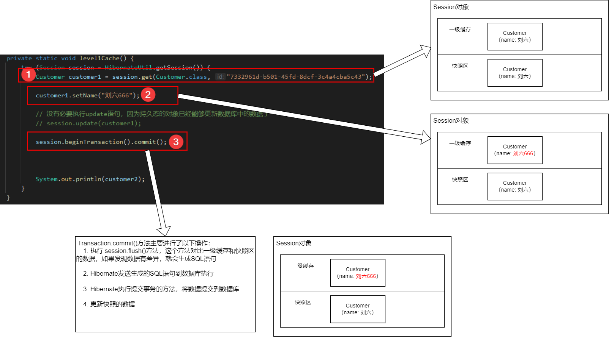

# Hibernate的优化策略

## 1. Hibernate对象的三种状态

在Hibernate的运行过程中，一个对象会存在以下三种状态，分别为：

- 临时状态：（**当对象的OID是使用数据库或Hibernate生成时**）没有对象OID值，没有被 Session 管理
- 持久化状态：有对象OID值，已经被 Session 管理
- 游离状态：有对象OID值，已经脱离 Session 管理
  > OID：Object ID，即对象主键


在Hibernate对象的三种状态中，最为重要的状态是持久态！
**持久态对象可以直接影响数据库中的数据！！！**

## 2. Hibernate的缓存机制

### 2.1 Hibernate的一级缓存

Hibernate的一级缓存其实就是 Session 对象中持有的缓存（就是 Session 内部的一个 Map 集合）。它的作用是为了减少程序和数据库交互次数，从而提高程序执行的性能。

> 例如在同一个 Session 中连续执行两次相同的查询，第二次查询不再访问数据库，直接从一级缓存中获取
> ```java
> Customer cust1 = session.get(Customer.class, id);
> // 查询 cust2 对象时不会生成查询语句，直接从 Session 持有的一级缓存中获取
> Customer cust2 = session.get(Customer.class, id);
> ```

### 2.2 Hibernate的快照机制

快照机制也是 Session 内部的一个 Map 集合，用于备份数据库的数据，用于和一级缓存的数据进行对比，以便实现持久态对象更新数据库的效果。

> 为什么持久态对象不需要执行 update 语句就可以影响数据库？
> 因为 Hibernate 的 Session 内部存在一级缓存和快照机制，在它们两个的共同作用下实现的。
> 

## 3. 一级缓存的管理

由上面的分析可知：如果持久态的对象不在一级缓存中，则不会直接更新数据库。那么，如何能把对象移出一级缓存呢？有以下几种方法：

1. `session.evict(Object)`方法：把一个对象移出一级缓存
2. `session.clear()`方法：把一级缓存中的所有对象移出

## 4. Hibernate的延迟加载策略

延迟加载即在使用特定属性或关联数据时进行按需加载，目的也是为了减少程序和数据库的交互，提升程序的性能。

执行机制：

1. 在查询一个对象的时候，不会到数据库查询对象的属性或者其关联的数据
2. 在需要使用到对象的属性或有关联数据的时候才会去查询数据库

### 4.1 类级别（属性）延迟加载

只有 `session.load()`方法才支持类级别的延迟加载。`session.get()`方法不支持类级别的延迟加载。

### 4.2 关联级别延迟加载

以一对多关联为例：

- 一方（使用`<set/>`配置）
  ```xml
  <!--
    lazy属性指定是否启用延迟加载，默认为true，
      设置为false时禁用延迟加载，也可以设置为extra，它是比true更加智能的一种加载方式，
      但是不能默认就设置为extra，因为如果使用场景不总是获取count的话，可能性能会更低 
   -->
  <set name="orders" table="cust_order" lazy="extra或true" inverse="true">
    <key column="customer_id"/>
    <one-to-many class="CustomerOrder"/>
  </set>
  ```

- 多方（使用`<many-to-one/>`配置）
  ```xml
  <!--
    lazy 延迟加载，默认为proxy。设置为false关闭 
   -->
  <many-to-one foreign-key="fk_cust_order_customer" name="customer" class="Customer" lazy="proxy">
    <column name="customer_id" sql-type="varchar(36)"/>
  </many-to-one>
  ```

## 5. Hibernate抓取策略

Hibernate的抓取策略是为了改变SQL语句查询的方式，从而提高SQL语句查询的效率（优化SQL语句）。

同样以一对多关联为例：

- 一方（使用`<set/>`配置）
  ```xml
  <set name="orders" table="cust_order" fetch="select、join或subselect" inverse="true">
    <key column="customer_id"/>
    <one-to-many class="CustomerOrder"/>
  </set>
  ```
  fetch默认为 select，即关联属性使用多条select语句进行查询；当配置成 join 时，会将多条select语句合并成一条左外连接（left
  join）语句进行查询，此时延迟加载会失效；当配置成 subselect 后，当同时查询多条一方的数据，且每一条数据都要访问关联的多方数据列表时，若使用默认的
  select
  配置，针对每一条一方数据都会执行一次多方表的查询，而使用 subselect 会使用一条SQL语句查询出所有的多方表的数据。

- 多方（使用`<many-to-one/>`配置）
  ```xml
  <many-to-one foreign-key="fk_cust_order_customer" name="customer" class="Customer" lazy="proxy" fetch="select或join">
    <column name="customer_id" sql-type="varchar(36)"/>
  </many-to-one>
  ```
  fetch默认为 select，即关联属性使用多条select语句进行查询；当配置成 join 时，会将多条select语句合并成一条左外连接（left
  join）语句进行查询，此时延迟加载会失效。

## 6. Hibernate的二级缓存

Hibernate的一级缓存就是Session对象内部的缓存，而Session对象在每次操作后都会关闭，一级缓存就会丢失！即一级缓存的作用域仅在一次业务操作内。

Hibernate的二级缓存是SessionFactory的缓存，即二级缓存的生命周期与SessionFactory一致，而SessionFactory一般是单例的，因此二级缓存可用于多次不同的业务操作。

> 注意：
> 1. Hibernate一级缓存默认是开启的，且无法关闭
> 2. Hibernate二级缓存默认是关闭的，如果需要开启，要引入第三方的缓存工具，例如EhCache等

